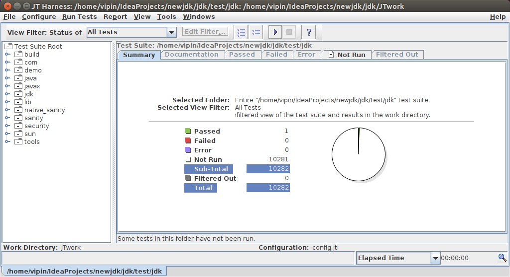

<!-- TOC START min:1 max:3 link:true asterisk:false update:true -->
  - [How to start contribution in OpenJDK](#how-to-start-contribution-in-openjdk)
    - [Prepare your development env](#prepare-your-development-env)
    - [Setting up the project in IDE](#setting-up-the-project-in-ide)
    - [Testing your change using JTREG](#testing-your-change-using-jtreg)
    - [Preparing patch](#preparing-patch)
    - [Two important things I learned in initial commits](#two-important-things-i-learned-in-initial-commits)
    - [Resources](#resources)
    - [At the end](#at-the-end)
<!-- TOC END -->


## How to start contribution in OpenJDK
(***This is initial draft for post***)

The first link to read should be: https://openjdk.java.net/contribute/

In this step 0 is get OCA signed.

Although the page says it takes 2 weeks, for me it was fast, I did some mistake in form and the oracle team helped me to submit it again.
It might take a couple of days' time, meanwhile, you can prepare your development env ready for contribution.

### Prepare your development env
The popular link you might find on google search to prepare env is from JDK11 specific branch:

https://hg.openjdk.java.net/jdk/jdk11/raw-file/tip/doc/building.html

Following is the link from latest JDK branch:

https://hg.openjdk.java.net/jdk/jdk/raw-file/tip/doc/building.html

<br>
From above link Instructions for the Impatient are:

1. Get the complete source code:
hg clone http://hg.openjdk.java.net/jdk/jdk

2. Run configure:
    bash configure

      If configure fails due to missing dependencies (to either the toolchain, build tools, external libraries or the boot JDK), most of the time it prints a suggestion on how to resolve the situation on your platform. Follow the instructions, and try running bash configure again.

3. Run make:
  make images

4. Verify your newly built JDK:
./build/*/images/jdk/bin/java -version

5. Run basic tests:
make run-test-tier1


In case you stuck anywhere in the above steps, most probably you can find a solution on [same page](https://hg.openjdk.java.net/jdk/jdk11/raw-file/tip/doc/building.html).
And it is ok to get stuck when you set up this first time, as it needs some libraries etc.

**2 Problems I faced are:**

    1.  Failure in configure command, it failed due to some external libraries missing.

    2.  Failure while running tests.


**For problem 1**, got a message on console saying install set of libraries and it worked after installing those.

Initially, I tried below, it failed due to case mismatch, it should have been libx11-dev not libX11-dev:

```
sudo apt-get install libX11-dev libxext-dev libxrender-dev libxtst-dev libxt-dev
```

This one worked!

```
sudo apt-get install libx11-dev libxext-dev libxrender-dev libxtst-dev libxt-dev
```


**For problem 2**, found below on the same page:

"Most of the JDK tests are using the JTReg test framework. Make sure that your configuration knows where to find your installation of JTReg. If this is not picked up automatically, use the --with-jtreg=<path to jtreg home> option to point to the JTReg framework. Note that this option should point to the JTReg home, i.e. the top directory, containing lib/jtreg.jar etc."

I have jtreg source code as well so in my case this option was something like this:
--with-jtreg=/home/vipin/IdeaProjects/jtreg/build/images/jtreg

Once your setup is successful and you execute tests, the result will be something like this:

At end of test you will see below output:

```
==============================
Test summary
==============================
   TEST                                              TOTAL  PASS  FAIL ERROR   
   jtreg:test/hotspot/jtreg:tier1                     1481  1481     0     0   
   jtreg:test/jdk:tier1                               1894  1894     0     0   
   jtreg:test/langtools:tier1                         4027  4027     0     0   
   jtreg:test/nashorn:tier1                              0     0     0     0   
   jtreg:test/jaxp:tier1                                 0     0     0     0   
==============================
TEST SUCCESS

Formatted output:

==============================
Test summary
==============================
   TEST                                              	TOTAL  PASS  FAIL ERROR   
   jtreg:test/hotspot/jtreg:tier1                     1481  	1481     0     0   
   jtreg:test/jdk:tier1                               1894  	1894     0     0   
   jtreg:test/langtools:tier1                         4027  	4027     0     0   
   jtreg:test/nashorn:tier1                             0     0     0     0   
   jtreg:test/jaxp:tier1                                 0     0     0     0   
==============================
TEST SUCCESS
```

<br>

### Setting up the project in IDE

After this, you may want to setup JDK project in IDE. I use IntelliJ and we have a shell script idea.sh comes along with jdk to setup a project for you. I wanted to setup module java.base only so my command was:
```
idea.sh java.base
```

In case you want to set up all modules then just run ```idea.sh```.

<br>

### Testing your change using [JTREG](https://openjdk.java.net/jtreg/index.html)

Two ways you can run JTREG tests, command line and GUI.

**Using command line**

Following command will run all the tests in the test/jdk/java/lang/Appendable/ and its sub-folders.
```
/home/vipin/IdeaProjects/newjdk/jdk$ /home/vipin/IdeaProjects/jtreg/build/images/jtreg/lib/jtreg.jar -jdk:/home/vipin/IdeaProjects/newjdk/jdk/build/linux-x86_64-server-release/jdk/  test/jdk/java/lang/Appendable/
```

Following command is running individual test Basic.java
```
/home/vipin/IdeaProjects/jtreg/build/images/jtreg/lib/jtreg.jar -jdk:/home/vipin/IdeaProjects/newjdk/jdk/build/linux-x86_64-server-release/jdk/  test/jdk/java/lang/Appendable/Basic.java
```


**JTREG GUI**

```
export JT_JAVA=/home/vipin/IdeaProjects/newjdk/jdk/build/linux-x86_64-server-release/jdk
vipin:/home/vipin/IdeaProjects/newjdk/jdk$ /home/vipin/IdeaProjects/jtreg/build/images/jtreg/bin/jtreg -g -jdk:$JT_JAVA -agentvm -automatic -verbose:summary -exclude:./test/jdk/ProblemList.txt test/jdk/
```
Following is JTREG GUI on my system




In above command test/jdk/ dir has TEST.ROOT file, below dirs have TEST.ROOT

```
vipin:/home/vipin/IdeaProjects/newjdk/jdk$ find . -name TEST.ROOT
./test/lib-test/TEST.ROOT
./test/jaxp/TEST.ROOT
./test/langtools/TEST.ROOT
./test/failure_handler/test/TEST.ROOT
./test/jdk/TEST.ROOT
./test/hotspot/jtreg/TEST.ROOT
./make/langtools/test/TEST.ROOT
```

### Preparing patch
Once you identify what you would contribute and then you need to prepare patch using [webrev.ksh](https://hg.openjdk.java.net/code-tools/webrev/raw-file/tip/webrev.ksh)

After copying webrev.sh in my jdk directory executed following command, it generated webrev dir and webrev.zip file in the same directory.

```
ksh ./webrev.ksh
```

After creating a patch you need bug id to submit patch against that bug, send email to the corresponding [email list](https://mail.openjdk.java.net/mailman/listinfo). Initially, someone should sponsor your fix and create a bug Id on your behalf.

Once you have bug id, submit a review request. The review request should be clearly marked as such: "RFR <bug-id>: <synopsis>"

e.g.
RFR 8240524: Removed warnings from test classes

You can not attach anything and send to the email list. If this is a small patch then you can add patch text in an email or talk to sponsor how do they want to accept it.

### Two important things I learned in initial commits
1. Update copyright year in files, there can be 2 formats for the year in files, it should be updated as follows:
```
 Copyright (c) 1999       ---> Copyright (c) 1999, 2020
 Copyright (c) 1999, 2016 ---> Copyright (c) 1999, 2020
```
2. A significant portion of code in package jdk.internal.icu comes from an upstream project, ICU4J. Changes in these packages should be done at [upstream](https://github.com/unicode-org/icu/tree/master/icu4j).


### Resources

1. https://openjdk.java.net/guide/index.html
2. https://hg.openjdk.java.net/jdk/jdk/
3. https://openjdk.java.net/contribute/
4. https://openjdk.java.net/bylaws#_7
5. https://adoptopenjdk.gitbooks.io/adoptopenjdk-getting-started-kit/content/en/
6. https://www.youtube.com/watch?v=dzm4EqLuuNQ video from [@brjavaman](https://twitter.com/brjavaman) and [@DavidBuckJP](https://twitter.com/DavidBuckJP)

<br>

### At the end
To learn Java language features you can join [mailing list](https://jfeatures.com/) and follow me on twitter [@vipinbit](https://twitter.com/vipinbit).
