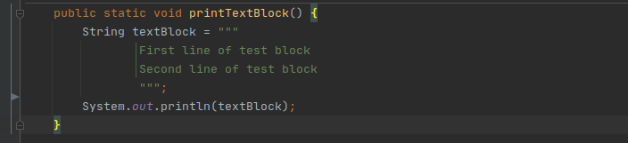
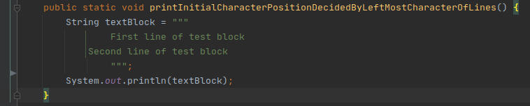
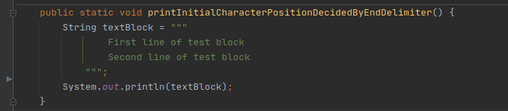
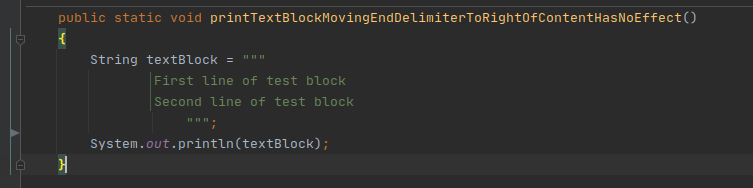

<!-- Attention -->
### Do you find Java multiline Strings not readable?

Multi line strings in java are often not readable which makes it error prone as well.
JDK 15 Standard feature Text blocks provides us better way to write strings that span several lines of source code.

<!--One of the goals for text blocks is to Simplify the task of writing Java programs 
by making it easy to express strings that span several lines of source code.
It makes code readable and bug free.
Let's try to understand its importance using the following example. 
-->

Let's check java code example to understand how text blocks makes our code more 
readable and bug free. 

Can you spot a bug in the multiline String below?

```java
String oldMultiLineStringSQL = "select emp_id, emp_name, emp_num_of_kids, emp_active" +
                             "from employee_table" +
                             "where employee_num_of_kids =1";

System.out.println(oldMultiLineStringSQL);
```
Following is the console output for oldMultiLineStringSQL. 

> select emp_id, emp_name, emp_num_of_kids, ***emp_<ins><span style="color:blue">activefrom</span></ins>***
> ***employee_<ins><span style="color:blue">tablewhere</span></ins>*** employee_num_of_kids =1

In this output notice the words underlined in blue, here we don't have spaces between words of consecutive lines. 
It causes SQLSyntaxErrorException.
Next section we will see how this problem can be solved by Text blocks. 

<br>

<!-- Interest -->
### Text Blocks Java code

Now the same code we are writing using Java Text Blocks.
<!-- todo show this on webpage, maybe ss, because this is clearly visible right now, it all comes in one line -->


    String sqlWithTextBlocks = """
                    select emp_id, emp_name, emp_num_of_kids, emp_active      
                    from employee_table      
                    where employee_num_of_kids =1 
                    """; 
    
Following is console output for text blocks, it is exactly the same as we have written in code. No issues due to space among consecutive lines.

> select emp_id, emp_name, emp_num_of_kids, emp_active
> from employee_table
> where employee_num_of_kids =1


<br>

<!-- Desire -->
### The deep dive into Text block syntax 

A text block consists of zero or more content characters, enclosed by opening and closing delimiters.

1. ***The opening delimiter*** is a sequence of three double quote characters (\"\"\") followed by zero or more white spaces followed by a line terminator.
2. ***The closing delimiter*** is a sequence of three double quote characters.
3. ***The content*** begins at the first character after the line terminator of the opening delimiter and ends before closing delimiter.

<!--
>     """
>     line 1    
>     line 2    
>     line 3    
>     """

Above text block is equivalent to the string literal:

> line 1\nline 2\nline 3\n
-->

<br>

### Text blocks compile-time processing

The content of a text block is processed by the Java compiler in three steps in the same sequence as given below:

1.    ***Line terminators***:               Line terminators in the content are translated to LF (\u000A).
    
2.    ***Common white spaces removal***:           Incidental white space surrounding the content, introduced to match the indentation of Java source code is removed in this step.
    
3.    ***Escape sequence processing***:     Escape sequences in the content are interpreted in this step. Performing interpretation as the final step means developers can write escape sequences such as \n without them being modified or deleted by earlier steps.


The following sections has all 3 steps of compile-time processing in more detail.

#### Line terminators
Different operating systems have their [Line terminators](https://en.wikipedia.org/wiki/Newline).
All line terminators (CR/LF/CRLF) in the content are translated into LF (\u000A). 
It makes the same java code work across all platforms.

<!--
    Incidental white space surrounding the content, introduced to match
    the indentation of Java source code, is removed.
    
    Example 1:
    
    Here is the HTML example using dots to visualize the 14 spaces per line that is added for indentation:
    
    String html = """
    ..............<html>
    ..............    <body>
    ..............        <p>Hello, world</p>
    ..............    </body>
    ..............</html>
    ..............""";
    
    In this example 14 initial spaces are removed by compiler, and output will be:
    
    |<html>|
    |    <body>|
    |        <p>Hello, world</p>|
    |    </body>|
    |</html>|
    
    Example 2:  Trailing space
    
    Here is the HTML example reimagined with some trailing white space, again using dots to visualize spaces:
    
    String html = """
    ..............<html>...
    ..............    <body>
    ..............        <p>Hello, world</p>....
    ..............    </body>.
    ..............</html>...
    ..............""";
    
    Following is output, here we are using | to visualize margins, we can see trailing white space is removed.
    
    |<html>|
    |    <body>|
    |        <p>Hello, world</p>|
    |    </body>|
    |</html>|
    
    @todo There are 3 ways to keep trailing whitespaces, suggested by JDK team.
    
    Example 3: Significant trailing line policy
    Moving position of closing delimiter can affect white space stripping. 
    For example when closing delimeter is moved all the way to the left, it completely avoids white space stripping.
    We will look at examples to understand it better.
    
-->

#### White space removal
Following two rules help us understand whitespace removal.
1.  There has to be one line terminator immediately after the initial opening delimiter.
2.  Now we have content and closing delimiter. if we move any line of content or closing delimiter to left it reduces common whitespace prefix. In other words, left most character in content or end delimiter decides the starting character of all lines in the text block.

Let's check some examples to understand how it works in practice.

In all the examples
 1. dots (.) is used to show spaces in code.
 2. Vertical bar (\|) is used to visualize the left margin.

***This is the first example*** having no whitespaces in the output.

```
public static void printTextBlock() {
....String textBlock = """
............First line of test block
............Second line of test block
............""";
....System.out.println(textBlock);
}
```

Following is Intellij idea screen shot for above code.


Following is the output, showing all incidental white spaces removed.

```
|First line of test block
|Second line of test block
|
```

<br>
***This is the second example*** showing initial character position in the text block is decided by start of the second line in text block content,
   out of all lines of content and end delimiter here second line has leftmost character.

```
public static void printInitialCharacterPositionDecidedByLeftMostCharacterOfLines() {
....String textBlock = """
............First line of test block
........Second line of test block
............""";
....System.out.println(textBlock);
}
```

Following is Intellij idea screen shot for above code.


Following is the output of the second example. 
We can see the initial 4 spaces that are common are removed in output.  

```
|    First line of test block
|Second line of test block
|
```

***This is the third example*** showing the effect of moving end delimiter to left.  


```
public static void printInitialCharacterPositionDecidedByEndDelimiter() {
....String textBlock = """
............First line of test block........
............Second line of test block........
........""";
....System.out.println(textBlock);
}
```

Following is Intellij idea screen shot for above code.


In the following output of the third example. We can see spaces at the end of the line are removed.
Moving end delimiter 4 spaces to left adds 4 spaces in all the lines.

```
|    First line of test block
|    Second line of test block
|
```

***This is the fourth example*** showing the effect of moving end delimiter to right.
Here we see moving end delimiter to the right of content has no effect.

```
public static void printTextBlockMovingEndDelimiterToRightOfContentHasNoEffect()
{
....String textBlock = """
............First line of test block         
............Second line of test block      
................""";
....System.out.println(textBlock);
}
```

Following is Intellij idea screen shot for above code.



Following is the output of the fourth example, it shows no effect of moving end delimiter to left, all common white spaces are removed. 
```
|First line of test block
|Second line of test block
|
```

In all these examples you can see green vertical bar in intellij idea shows starting character of lines in text block.

<!-- Developers will have access to escape processing via String::translateEscapes, a new instance method. 
     todo Show use of this method -->
<br>
#### Escape processing
This is the third and last step of compile time processing. We have seen first line terminators are interpreted, then the next step is white space removal and at the end
escape processing. And because this is last step in compile time processing when we use \n (or any other escapae sequence) in text block content, it will not be modified by the initial 2 steps and will be interpreted
at the end.

Let's learn different language features in escape processing using the below code example.

```
private static void printEscapeProcessing() {
....String textBlock = """
............"Hello\n
............Text Block " ' \\ \t "
............experiment another opening/closing delimiter type of 3 consecutive quotes \"""
............without newline concatenation of Strings \
............spaces \s\sat end in this way trailing spaces are not removed\s\s
............\"""";
....System.out.println("printEscapeProcessing");
....System.out.println(textBlock);
}
```

Following is the output of the above escape processing example.

```
|printEscapeProcessing
|"Hello
|
|Text Block " ' \ 	 "
|experiment another opening/closing delimiter type of 3 consecutive quotes """
|without newline concatenation of Strings spaces ..at end in this way trailing spaces are not removed..  
|"
```

In the above output few things to observe are:
1. \n is allowed in the text block, and it generates an additional new line in the output.
2. " and ' can be used anywhere in text blocks like Strings.
3. to use \ we need to use \\\\.
4. Sequences of three " characters require the escaping of at least one " to avoid mimicking the closing delimiter.
5. To allow finer control of the processing of the newlines and white space, two new escape sequences are introduced in java 15, these were not present in earlier preview versions.  
   1.    ***\\*** at the end acts like concatenation of 2 Strings, in other words, it avoids line terminator between consecutive lines.
   2.    ***\\s*** adds space, in example output spaces are shown with dots (.)

<br>

### Common mistakes in text blocks
Here are some examples of ill-formed text blocks:

```
String a = """""";   // no line terminator after opening delimiter
String b = """ """;  // no line terminator after opening delimiter
String c = """
           ";        // no closing delimiter
String d = """
           abc \ def
           """;      // unescaped backslashs

```
<br>

### At the end

Knowing language features like this helps you get the best java jobs, that's why to help you
I wrote ebook [5 steps to Best Java Jobs](https://jfeatures.com/).
Download this step by step guide for free!

[](https://jfeatures.com/)


### Resources
1. https://openjdk.java.net/jeps/378, This is Java enhancement proposal for text blocks in JDK15.
2. https://github.com/Vipin-Sharma/JDK15Examples, this is link to code examples used in this post.